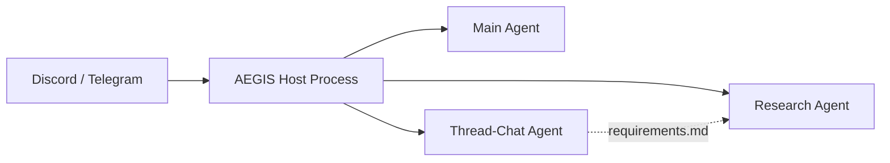

# AEGIS

Autonomous threat intelligence. Research threats, generate validated detection rules, deliver reports — through Discord and Telegram.

**[Documentation](https://thomaspark20.github.io/Aegis)** | **[Getting Started](https://thomaspark20.github.io/Aegis/guide/getting-started)**

## Quick Start

```bash
git clone https://github.com/ThomasPark20/Aegis.git
cd Aegis
claude
/setup
```

`/setup` walks you through everything: dependencies, Docker, API credentials, and channel setup (Discord/Telegram). It'll ask which channels you want and guide you through bot creation, permissions, and registration — all in one flow.

## What It Does

### Research on Demand

Ask AEGIS to research any threat — it creates a Discord thread, runs a full investigation pipeline, and delivers a structured report with validated detection rules.

```
You: "Research Lazarus Group"
AEGIS: "On it — spinning up a research thread."

→ Thread: Research: Lazarus Group
  AEGIS researches primary sources, extracts IOCs, maps TTPs,
  generates Sigma/YARA/Snort rules, delivers .md report
```

### Dual-Agent Research Threads

Each research thread runs two agents concurrently:

| Agent | What it does | Speed |
|-------|-------------|-------|
| **Chat agent** | Answers questions, records requirements | Seconds |
| **Research agent** | Deep investigation, IOC extraction, rule generation | Minutes |

Send follow-ups in the thread — the chat agent responds instantly while research continues in the background:

```
You: "Are any Lazarus members on the FBI most wanted list?"
AEGIS (chat): "Yes — Park Jin Hyok was indicted in 2018..."

You: "Include their info in the report"
AEGIS (chat): "Got it — added to research requirements."

→ Research agent checks requirements.md before delivering
→ Report won't ship until all requirements are addressed
```

### Research Requirements

Follow-up messages become mandatory checklist items in `requirements.md`. The research agent validates every requirement before delivering the final report — it's a contract, not a suggestion.

### Automated Monitoring

- **RSS feed scanning** — every 2 hours, CTI feeds are scanned. Critical items (APTs, CVEs, zero-days, ransomware) get their own research thread automatically
- **Daily briefing** — compiles all research from the day into an executive report, delivered as a Discord thread at your configured time

### Detection Rules

Sigma, YARA, and Snort rules — validated with real CLI tools before delivery. Failed rules retry 3 times. If still failing, marked as unvalidated so nothing is silently dropped.

### Thread Re-activation

Research threads expire after 10 minutes of inactivity but are **soft-deleted** — send a message to bring them back with full context, session, and research files preserved.

## Architecture



Each agent runs in an isolated Docker container with its own filesystem, IPC namespace, and Claude session. Credentials are injected at runtime via OneCLI — containers never see real secrets.

## Prerequisites

- Git
- Node.js 22+
- Docker
- [Claude Code](https://docs.anthropic.com/en/docs/claude-code)
- Anthropic API key or Claude Pro/Max subscription

## Built on NanoClaw

AEGIS is built on [NanoClaw](https://github.com/qwibitai/nanoclaw), an open-source personal Claude assistant framework.

## License

MIT
